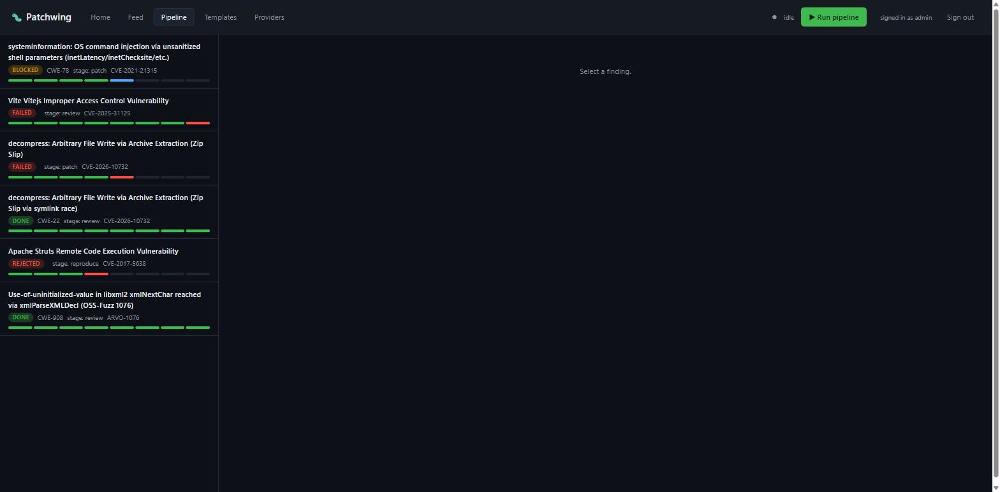

# PatchWing

**Verified bug fixing — not vulnerability discovery.**

PatchWing takes a *known* bug — an advisory, a Semgrep hit, a fuzzer crash on code you
already own — and produces a fix a maintainer can merge in a few minutes: a reproducer that
**fails before the fix and passes after**, the patch itself, the project's own test suite
still green, a **byte-exact rollback proof**, and a container **anyone can re-run** to check
the whole thing by hand.

The patch is the cheap part — a model will write a plausible one on demand. **The product is
the evidence** that the patch closes the specific bug and that removing it brings the bug
back. Nobody merges an AI patch on faith; PatchWing is built to make the review cheaper than
ignoring the finding.

> Finding bugs at scale is a solved-enough problem. Fixing them at the same scale, with proof,
> is not. PatchWing is built for the fixing half.

**What it costs:** the `decompress` CVE below was reproduced, patched, and verified for **≈ $1.28**
on a hosted endpoint (~4¢ on a cheap model tier, ~$0 self-hosted) — under a $25 ceiling it never
approached. The average data breach costs **$4.99M** ([IBM 2026](https://www.ibm.com/reports/data-breach)).
Full breakdown: [Why PatchWing → The economics are lopsided](WHY-PATCHWING.md#the-economics-are-lopsided).



## Documentation

New here? Start with **[Why PatchWing](WHY-PATCHWING.md)** for the case, then the
**[User Manual](docs/PatchWing-User-Manual.docx)** to install and run.

| Document | What it covers |
|---|---|
| **[Why PatchWing](WHY-PATCHWING.md)** | The case: finding isn't the bottleneck, verified fixing is — and why nothing else covers it. Read this first. |
| **[The economics](ECONOMICS.md)** | The business case on one page: what a fix really costs (~$1.28) against what a breach costs ($4.99M), with an illustrative calculator. |
| **[User Manual (Word)](docs/PatchWing-User-Manual.docx)** | The full manual with screenshots — install, configure, run, read the output. |
| [Tutorial](docs/TUTORIAL.md) | Install → point it at your own endpoint → add & run a finding → read the bundle. |
| [Worked example](docs/WORKED-EXAMPLE.md) | A real CVE (`decompress` Zip-Slip) closed end-to-end, with the actual diff and red→green→revert→red chain. |
| [Evidence package](docs/EVIDENCE-PACKAGE.md) | Anatomy of the output bundle — the provenance and the `apply`/`verify`/`rollback` scripts a maintainer runs. |
| [Release notes & field report](RELEASE-NOTES.md) | What works today, honest model-performance notes, a failed run written up in full, and what to expect operating PatchWing through an AI agent. |
| [Example bundle](examples/decompress-CVE-2026-10732-evidence-bundle/) | A complete, real evidence bundle (126 files) you can inspect and re-run offline. |

---

## Status — September 2026

Read this before anything else. It is deliberately un-varnished.

- **The pipeline runs end-to-end.** Three real CVEs have been carried
  `ingest → localize → reproduce → patch → verify → package`, each producing a full evidence
  bundle (see [Worked examples](#worked-examples)).
- **All three completed the full chain** — `red → patch → green → rollback → red again`.
  Vite got there last: the verifier first **refused to certify a rollback it could not
  actually observe** (`harness_fault`, not a fake red), which surfaced a genuine harness bug
  — a long-lived dev-server reproducer reused a stale server across the rollback leg. Once
  that was fixed (a pre-rollback daemon reset), Vite's chain closed too. The refusal doing its
  job — exposing a real defect instead of papering over it — is the system working as designed.
- **It is still early.** Single-operator development deployment. All three model seats
  currently run the *same* model, so the "independent second opinion" is advisory only — and
  the tool says so, in the evidence itself. **No upstream pull request has been submitted
  anywhere yet**, and the disclosure policy is not finalised. (The licence is: released under
  [Apache 2.0](LICENSE).)
- **What it does not do yet:** prove a patch is *globally* correct (only that the frozen
  reproducer flips and the suite stays green), run a genuinely different-family verifier, or
  operate unattended against repositories you do not control.

If a claim here is not backed by an artifact you can recompute, it is a bug in this document.

---

## What it is *not*

- **Not exploit discovery.** Reproducers stay at **Definition A**: a trigger input plus an
  *observable boundary violation*. It stops at "the bad outcome happened" and never proceeds
  to "and here is what an attacker does next."
- **Not a scanner.** Discovery is an *input*. You run your own fuzzers (AFL++) and sanitiser
  builds (ASan/MSan/UBSan) on code you own; PatchWing consumes the crash or the advisory and
  fixes it. It never goes hunting on systems the operator does not control.
- **Not autonomous.** A machine never signs off its own patch. The terminal stage is a human
  reading a prepared package.
- **Not "auto-remediation."** That term now means dependency version-bumping (GitLab, Snyk,
  Dependabot) — swapping to a fixed release *when one already exists*. PatchWing's whole
  reason to exist is the bugs where **there is no version to bump to** because nobody has
  written the fix yet.

---

## The pipeline

```
ingest     validate the finding has enough to work with
localize   narrow to the files holding the flaw
reproduce  build a reproducer that FAILS on the unpatched code, then FREEZE it
patch      generate the fix (a minimal diff) plus, where possible, a regression test
verify     in a sandbox: apply, reproducer passes, project suite stays green,
           then roll back and prove the bug returns
package    assemble the evidence bundle a human will read
review     human sign-off — a machine never signs its own work off
```

Each finding is a row in a SQLite database; each stage is a function; progress is a loop.
There is no workflow engine. The deployment target is a customer's VPC with no outbound
network, and shipping a server, a database and a UI into a security review is a liability.

The bar for the output is a single sentence: **a PatchWing PR must be cheaper to review than
to ignore.** If review takes more than a few minutes, we have added load to the maintainers
who are the real bottleneck, not removed it.

---

## How a "green" is actually decided

This is the load-bearing part of PatchWing and the reason its "pass" is worth anything. The
intuitive version — "run the reproducer, check the exit code" — is wrong in two ways that
matter.

### 1. The verdict is read from the reproducer's **output**, never its exit code

`verify` runs the reproducer inside the pod, captures stdout+stderr, and classifies *that
text*. Exit code is secondary, consulted only when there is no marker — because real targets
lie about exit codes: an ASan build under one harness exits `1` on everything, MemorySanitizer
with `abort_on_error=0` exits `0` on a genuine failure, and a missing mount also exits `1`.
Under a naive "non-zero = bug reproduced" rule, *every malfunction reads as a successful
reproduction* — and at rollback the assertion literally *is* "red again," so any malfunction
would satisfy it. A check that cannot fail.

So a red is: **a sanitizer marker plus a matching crash identity** (`DEDUP_TOKEN`), or for an
HTTP-shaped finding, the operator's declared evidence rule firing against the parsed wire
output.

### 2. There are **four** states, never two

| state | meaning |
|---|---|
| `confirmed_red`   | marker/rule present **and** the crash identity matches the pristine reproducer |
| `confirmed_green` | clean, no marker, and every declared rule was affirmatively reached with a non-vulnerable reading |
| `different_bug`   | a marker fired, but the crash identity does **not** match — this is not our bug |
| `harness_fault`   | no marker + non-zero exit, or a timeout, or a reading too fast to be real |

`different_bug` and `harness_fault` are **neither red nor green and must never fold into
either.** The whole module exists to prevent one failure mode, stated four different ways in
four different files:

> **Absence must never wear failure's face.** A timeout is not a rejection. Exit-1-with-no-marker
> is not a reproduction. A broken build is not a verdict on the patch. An infrastructure error
> is not a judgement.

Every terminal path that is *not* a real verdict carries `patch_evaluated: false`.

### 3. The chain: red → apply → green → revert → **red again**

All inside one persistent container (a deliberate, narrow exception to
one-container-per-attempt — a fresh pod would reintroduce every variable the rollback exists
to hold still):

1. hash the target file (**before_patch**)
2. apply the fix, hash again (**after_patch**)
3. re-hash the *frozen* reproducer files — any change **voids the run** (the "wall")
4. build, run the reproducer, classify → must be `confirmed_green`
5. **only then**, the rollback leg: revert to the exact pre-patch bytes, hash (**after_revert**),
   and assert `after_revert == before_patch` **byte for byte** (the *§6a hash triple*);
   rebuild, re-run → must read `confirmed_red` **again**.

There is deliberately **no "re-apply and leave it green" step.** The proof is the chain
itself: it shows both that the fix closes the bug *and* that the fix is *what* closed it
(removing it brings the bug back). The green fix lives in the patch artifact and the evidence
bundle, never in the container's final state, which is torn down.

**Rollback is evidence, not a gate.** If the revert does *not* come back red, that does **not**
reject the patch — the container already ruled green. A green-then-not-red result indicts the
*undo mechanism or the oracle*, not the fix, and is recorded honestly as
`verify_green_rollback_not_red`. The one outcome the whole design exists to produce is
`verify_green_rollback_red` — the full chain.

### 4. The wall

The reproducer's files are frozen under sha256 *before any patch exists* and re-checked after
the patch is applied and again after the suite runs. If any byte changed, the run is void. So
a "pass" cannot have been obtained by weakening the test. Every evidence bundle prints the
frozen hashes so a reviewer can recompute them.

---

## Worked examples

These are real findings closed by the running pipeline. Each is reproduced in `examples/`
with the full evidence bundle; the diffs and readings below are copied verbatim from the
database.

### 1. `decompress` — CVE-2026-10732, Zip Slip via symlink race (full chain) ✅

**CWE-22 · npm · [`kevva/decompress`](https://github.com/kevva/decompress)** — an archive
with two entries at the same path (a symlink to an arbitrary target, then a regular file)
writes the file's content *through* the symlink, outside the output directory. Root cause: the
symlink guard runs concurrently via `Promise.all(files.map(...))`, so it checks for the
symlink *before* the earlier entry has finished creating it.

The fix serialises extraction so each entry is fully written before the next entry's safety
checks run:

```diff
--- a/node_modules/decompress/index.js
+++ b/node_modules/decompress/index.js
@@ -73,7 +73,7 @@
 		return files;
 	}
 
-	return Promise.all(files.map(x => {
+	return files.reduce((promise, x) => promise.then(() => {
 		const dest = path.join(output, x.path);
 		const mode = x.mode & ~process.umask();
 		const now = new Date();
@@ -125,7 +125,7 @@
 			.then(() => x.type === 'file' && fsP.utimes(dest, now, x.mtime))
 			.then(() => x);
-	}));
+	}), Promise.resolve()).then(() => files);
 });
```

The chain, verbatim:

```
UNPATCHED  →  {"status":"extracted","zipslip_pwned":"True",...}     confirmed_red
PATCHED    →  {"status":"error","error":"Refusing to write into a
               symlink","zipslip_pwned":"False"}                    confirmed_green
REVERTED   →  {"status":"extracted","zipslip_pwned":"True",...}     confirmed_red  (again)

§6a hash triple:  8829ae54… → 9029a6d8… → 8829ae54…   after_revert == before_patch ✓
wall: 3 files, sha256, intact          outcome: verify_green_rollback_red
```

**The honest caveat, from the bundle itself.** The advisory reviewer (see below) marked this
patch **"concerns"**: the serial fix closes the reproduced race, but it flagged residual
CWE-22 surface the reproducer does *not* exercise — a broken `indexOf`-based path-containment
prefix check, symlink targets never validated against the output root, and a residual TOCTOU
window. **This is exactly the boundary of what a container can prove:** the reproducer is
demonstrably closed; that the patch is *globally* correct is not, and the bundle says so
rather than implying otherwise.

### 2. `libxml2` — OSS-Fuzz 1076, use-of-uninitialised-value (full chain, native) ✅

**CWE-908 · C · ASan/MSan.** The sanitizer-kind counterpart, to show the pipeline is not
HTTP-only. The reproducer is a 699-byte input; the pristine reading is
`SUMMARY: MemorySanitizer: use-of-uninitialized-value`, exit `77`, with a `DEDUP_TOKEN` crash
identity. The full chain completed: patched build clears the sanitizer, reverting brings the
same `DEDUP_TOKEN` back at exit 77 — `verify_green_rollback_red`. The verdict is read from the
sanitizer marker and token, never the exit code (which is a non-distinctive `1` or `77` on
this target).

### 3. `Vite` — CVE-2025-31125, `fs.deny` bypass (full chain — and how it got there) ✅

**npm · [`vitejs/vite`](https://github.com/vitejs/vite)** — `?raw?import` / `?inline&import`
requests served file content past the `server.fs.deny` allow-list. The fix adds a serving-access
check for those import requests:

```diff
--- a/packages/vite/src/node/server/middlewares/transform.ts
+++ b/packages/vite/src/node/server/middlewares/transform.ts
@@ -72,6 +72,17 @@
     const withoutQuery = cleanUrl(url)
 
+    if (
+      (/[?&]raw(?:[?&]|$)/.test(url) || /[?&]inline(?:[?&]|$)/.test(url)) &&
+      isImportRequest(req)
+    ) {
+      if (!ensureServingAccess(url, server)) {
+        return next()
+      }
+    }
+
     try {
```

- **Red, proven:** unpatched, the dev server returned `HTTP/1.1 200` serving the planted canary
  `export default "PW-VITE-SIDECHANNEL-a3f9b1c7-LEAKED"` — `confirmed_red`.
- **Green, proven:** patched, `HTTP/1.1 403 Forbidden … outside of Vite serving allow list`,
  canary not leaked — `confirmed_green`. The `after_revert == before_patch` hash triple passed.
- **Rollback, at first not certified:** on the reverted tree the rebuilt server *still*
  returned 403, so the classifier called it `harness_fault` — **it refused to record a red it
  could not actually observe** — and the outcome was `verify_green_rollback_not_red`. Root
  cause (proven by PID reuse): the reproducer starts the Vite dev server with a "start only if
  not already running" guard, so the green leg's server — still holding the *patched* code in
  memory — was reused on the rollback run instead of relaunching against the reverted code.
- **Rollback, fixed and certified:** a pre-rollback daemon reset in the verify leg kills the
  lingering server so the reproducer's own guard relaunches it fresh against the reverted
  dist. The rollback then read `confirmed_red` (the canary leaked again) →
  `verify_green_rollback_red`, full chain. Re-verified live at zero model spend.

We keep this example because of *how* it was found. **The four-state classifier refused to
fake a red it couldn't observe, and that refusal is exactly what surfaced the harness bug.** A
"non-zero = reproduced" oracle would have rubber-stamped a green-looking rollback and hidden
the defect; the honest one turned it into a fix.

---

## The evidence package ("documents for people to do it")

Every closed finding emits a single reviewable bundle. It is designed so a maintainer who has
never heard of PatchWing can accept or reject it without trusting us. It contains:

- **What was wrong** and **why this fix closes it**, in plain prose.
- **The reproducer**, and the `confirmed_red` reading it produced on the unpatched code.
- **The patch** (minimal diff) and the `confirmed_green` reading after it.
- **The chain** — the §6a hash triple and the red-again reading (or an honest note that it was
  not certified).
- **Re-run it yourself** — the exact sandbox to reproduce by hand:
  ```
  backend : podman
  image   : patchwing-provisioned-<finding-id>
  network : none          (disabled, so nothing can phone home mid-run)
  reproduce : cd <target> && bash reproduce.sh
  ```
- **Reproducer attestation** — the frozen sha256 of every reproducer file, to recompute.
- **Advisory review** — a model's opinion on the patch, clearly stamped *"an opinion, not a
  verdict; it did not and cannot change the pass/fail decided by the container,"* printed
  **with the exact model, endpoint, temperature and independence caveat that produced it**,
  because a verdict has been observed to flip on a single flag.
- **Cost** — calls, tokens and dollars per seat.

---

## Design decisions

- **Findings are rows, stages are functions, progress is a loop.** No Temporal/Airflow/Argo.
  When durable cross-machine retries genuinely become necessary, the stage contract ports
  without callers changing.
- **All state in one SQLite file.** The flow must be inspectable by a human without running
  PatchWing — `sqlite3 patchwing.db` beats any dashboard.
- **Patches are never rebased.** Every artifact records the commit it was generated against. If
  the repo moved while a finding sat in review, the patch is *stale by definition* and the
  stage regenerates it. This eliminates PR-time desync as a class of bug.
- **Models are per-role and swappable.** `provision`, `patch` and `verify` each get their own
  endpoint, model and key. Everything speaks OpenAI-compatible, so Together, Z.ai, vLLM,
  Ollama and llama.cpp are config, not code. The fix-writer is interchangeable *by design*:
  the container decides whether a patch is accepted, not the model's reputation.
- **No default provider.** Point it at your own inference server. When Hugging Face was breached
  in July 2026, commercial frontier models *refused* to analyse the attack logs — guardrails
  could not distinguish an attacker building an exploit from a defender detecting one — and HF
  ran an open-weight model inside their own perimeter instead. PatchWing assumes that posture
  from the start.

---

## Usage

```bash
cp patchwing.example.toml patchwing.toml       # then edit it
export PATCHWING_PATCH_KEY=...                 # keys live in the environment, never the file

python -m patchwing.cli config                 # show what resolved (keys masked)
python -m patchwing.cli preflight              # probe endpoints before spending

python -m patchwing.cli add https://github.com/org/proj \
    --source advisory --ref GHSA-xxxx-1111 --cwe CWE-787 \
    --title "Heap overflow in parser"

python -m patchwing.cli run                    # advance everything that is ready
python -m patchwing.cli status                 # stage × state matrix
python -m patchwing.cli list --state blocked
python -m patchwing.cli show <id>              # artifacts, events, staleness
python -m patchwing.cli unblock <id> --note "reviewed"
```

The pipeline runs with **no** models configured — stages needing one block with a reason — so
you can see its shape before committing a key.

### Preflight

Before a campaign, `preflight` checks every configured role for reachability, structured-output
adherence, and **whether the endpoint will engage with a plainly defensive security question.**
Non-zero exit if any role fails, so it drops into CI. That third check exists because it is the
failure that stopped Hugging Face's blue team: learning your endpoint refuses benign defensive
prompts is free at startup and expensive three hours into a batch.

### Configuration shape

Per-role model config, plus sandbox and per-finding limits (keys resolve from the environment):

```toml
[models.patch]
endpoint    = "https://your-endpoint/v1"
model       = "your-model"
temperature = 0.2          # retry variance for stuck patches
max_tokens  = 65536
api_key_env = "PATCHWING_PATCH_KEY"

[models.verify]
temperature = 0.0          # maximum determinism for the verdict seat
# ... endpoint / model / api_key_env as above

[sandbox]
backend           = "podman"
network           = "none"     # the reproducer pod cannot reach the network
provision_network = "bridge"   # only the build phase may fetch dependencies
cpus              = 2.0
memory            = "2g"

[pipeline]
max_attempts           = 4
max_usd_per_finding    = 25.0
max_patch_bytes        = 65536
reproducer_scope       = "definition_a"   # the scope boundary, enforced
```

---

## Model stack

The discovery-adjacent half can run entirely on open weights, air-gapped; only the fixer needs
a large model.

| role | component | licence | notes |
|---|---|---|---|
| prefilter | Semgrep CE | LGPL | cheap, deterministic, noisy |
| crash discovery | AFL++ / ASan | OSS | uncontaminated by construction |
| localization | small open localizer | Apache-2.0 | ranking aid |
| **fixer** | a large open-weight code model (e.g. GLM-5.2, MIT) | MIT | the only stage needing a big model |
| verifier | *should be a different family than the fixer* | — | see limitations |

Avoid CodeQL (commercially restricted) for anything you intend to redistribute.

---

## Sandbox posture

Containers are the default sandbox; the repo's own `Dockerfile` / `.devcontainer.json` defines
the environment. The reproducer pod runs with `network: none`; only the build/provision phase
is allowed a bridge, and even that logs every host it resolves so an egress allowlist can be
built from observed traffic. Firecracker microVMs are the stronger-isolation option for
deployments with nested virtualisation available.

---

## Evaluation & the contamination trap

Ground truth comes from known CVE-fix pairs: the pre-patch commit is the bug, the upstream diff
is the answer. **Contamination is the trap that would silently invalidate everything** — GHSA
advisories and their fixes are in the training data of every candidate model, so a high score
can measure memorisation rather than capability. Mitigations: weight toward advisories
published *after* model cutoffs, use fresh fuzzer crashes with no public fix, and keep a blind
set that is never iterated on. Harnesses worth reusing: **ZeroDayBench** (built specifically
against contamination), **ARVO** (real reproduced OSS-Fuzz bugs — closest to PatchWing's task;
grade on the *reproducer flip*, never on commit-match, since ARVO's fix labels are noisy).

---

## Security & scope

PatchWing is **defensive-only**. It fixes bugs in code the operator controls or is authorised
to fix; it does not scan, hunt, or probe third-party systems, and its reproducers stop at
Definition A (an observable boundary violation), never at a weaponised exploit chain. The
worked examples above use CVEs that are **already public and already fixed upstream** — they
are evaluation targets, not disclosures.

If you find a security issue **in PatchWing itself**, please open a private report rather than a
public issue. (A standalone `SECURITY.md` accompanies this README with the reporting address.)

---

## Limitations (the honest list)

- **Correctness ≠ test-passing.** The container proves the frozen reproducer flips and the
  suite stays green. It does **not** prove the patch is semantically correct in general — see
  the residual CWE-22 the reviewer flagged on the `decompress` patch. This is the real open
  research problem in the stack.
- **The verifier currently shares a model family with the fixer.** All three seats run one
  model today, so the "adversarial second opinion" is advisory only and its errors correlate
  with the fixer's. The evidence bundle stamps this as `independence: WEAK` rather than hiding
  it. A genuinely different-family verifier is the intended state.
- **Long-lived-server reproducers need a clean restart between the green and rollback legs.**
  A daemon reproducer that reuses an already-running server would read the *patched* server on
  the rollback run; the verify leg now resets lingering listeners before the rollback reproduce
  so the reproducer relaunches against the reverted code (fixed; see Vite). The general
  principle stands: when the tool genuinely cannot observe a red, it records the honest outcome
  rather than faking one.
- **Single-operator dev deployment.** Not multi-tenant; the admin web plane is unhardened and
  intended for localhost / a trusted host only. Harden before any networked use.
- **No upstream PR has been submitted anywhere.** The receipts are self-contained bundles, not
  merged fixes — yet.

---

## Licence

**[Apache License 2.0](LICENSE).** Free to use for any purpose, including commercial and
enterprise use, with an explicit patent grant. Attribution is appreciated but not required —
see [`NOTICE`](NOTICE); if PatchWing is useful to you, a link back is welcome.

Nothing in the fixer/verifier stack forces a copyleft licence (GLM-5.2 is MIT; the small open
models are Apache-2.0). Avoid bundling anything commercially restricted (e.g. CodeQL) if you
redistribute.

---

*Every evidence bundle is generated by PatchWing and then **reviewed by a human before
submission**. The fix is tested, not trusted: which model wrote it does not affect the verdict.*
