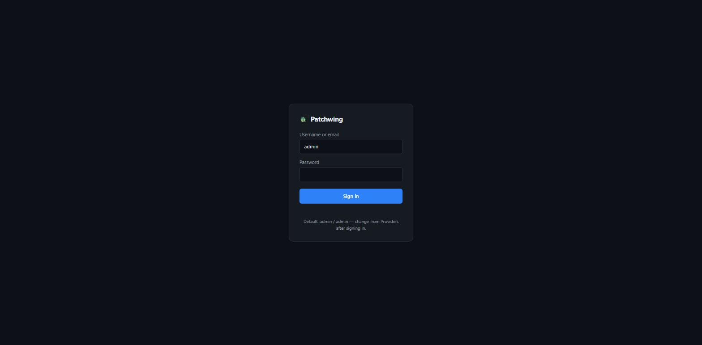
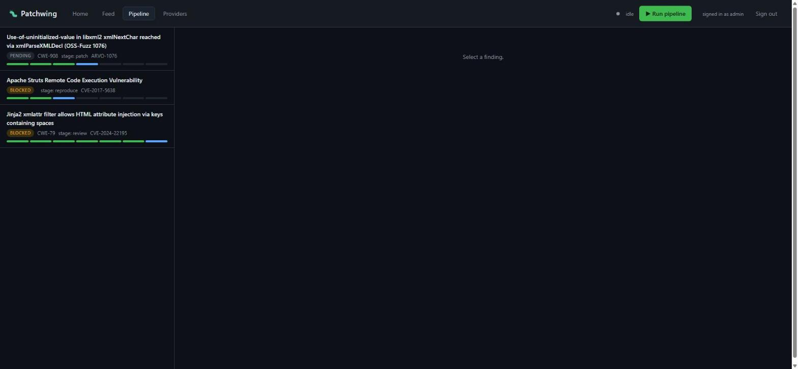
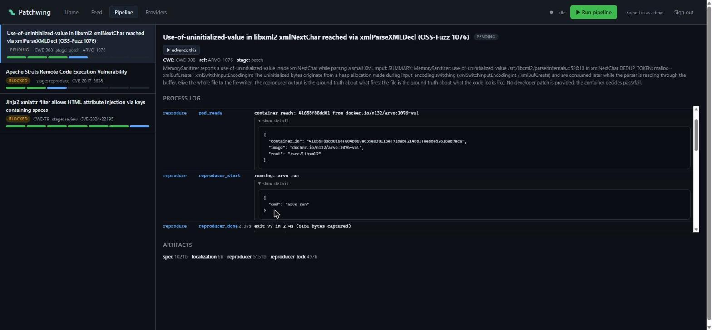
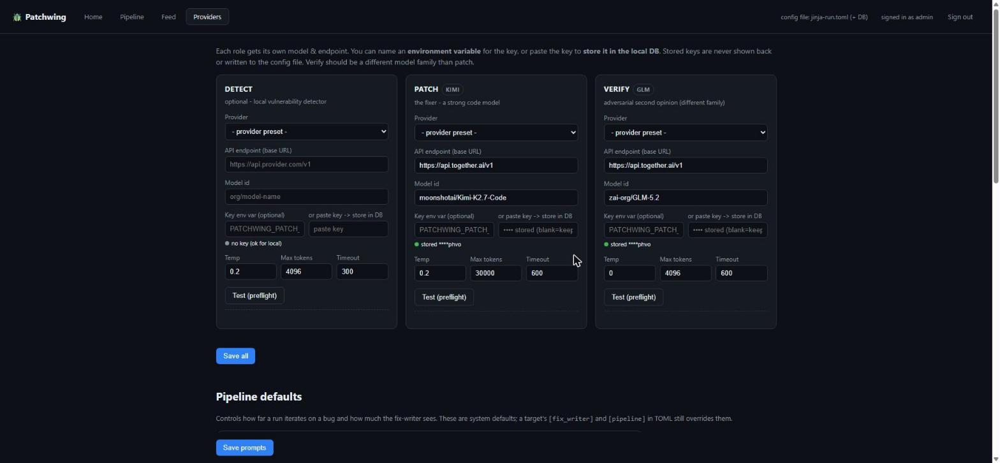
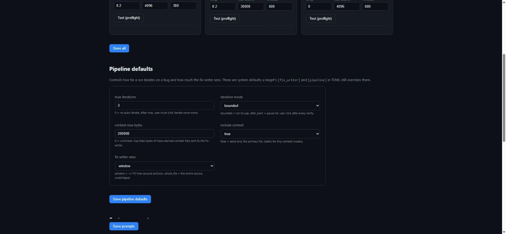
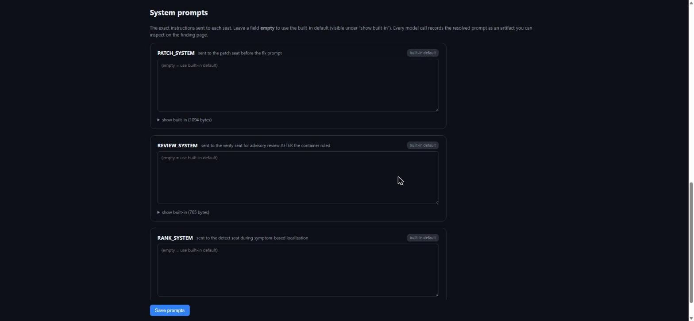

# PatchWing — How-to & FAQ

PatchWing is a defensive vulnerability-closure pipeline. It takes a known bug, reproduces it in a container, has a fix-writer model produce a patch, rebuilds, re-runs the reproducer to prove the fix works, and rolls back to prove the diff was load-bearing — everything visible and auditable in a web UI.

This document walks through the end-to-end user flow, the pipeline stages, and the configuration surfaces.

---

## 1. Signing in

Point a browser at your PatchWing server (e.g. `http://192.168.1.250/`). Any page that isn't `/login` redirects there. Default credentials on a fresh install:

- **Username:** `admin`
- **Password:** `admin`

Change the password from the Providers page after signing in. The session cookie is HttpOnly, SameSite=Lax, and expires after 30 days of inactivity.



---

## 2. The pipeline in one page

A finding moves through seven stages, in order:

```
ingest  →  localize  →  reproduce  →  patch  →  verify  →  package  →  review
```

| Stage | What it does | Which seat is called |
|---|---|---|
| **ingest** | Validates the finding has enough to work with (repo URL, source ref, description) | none |
| **localize** | Picks the source file(s) that hold the bug. Two paths: (a) declared in the spec (oracle), (b) model-derived by asking a symptom localizer | `detect` (optional) |
| **reproduce** | Runs the reproducer inside a fresh container, four-state classifies the result (`confirmed_red` / `confirmed_green` / `different_bug` / `harness_fault`), freezes the wall (sha256 of the reproducer input), records the pristine `DEDUP_TOKEN` | none |
| **patch** | Reads the vulnerable source from the pod, assembles a prompt (system + user with description + trace + source + trace-derived context files), sends it to the fix-writer, applies the returned SEARCH/REPLACE blocks | **`patch`** |
| **verify** | Writes the patched file back to the same pod (**pod-per-finding**), rebuilds incrementally, re-runs the reproducer, four-state classifies. Then **rollback**: reverts the file, rebuilds, re-runs, four-state re-reads. Records the `sha256` hash triple (before / after / after-revert). | none (advisory reviewer optional, `verify` seat) |
| **package** | Assembles the evidence bundle: description, reproducer, diff, four-state readings, hash triple, provenance | none |
| **review** | Human gate — always blocks | none (human) |

The **pod is created on first reproduce and stays alive across every subsequent stage on that finding.** After the first full `arvo compile`, verify + rollback use incremental builds — seconds instead of minutes.

---

## 3. The dashboard

The main workspace lives at `/app`.

**Left column**: every finding in the DB with its title, badge (`PENDING` / `RUNNING` / `BLOCKED` / `DONE` / `REJECTED` / `FAILED`), current stage, and a 7-segment progress bar showing which stages have been reached.

**Right column** (once you click a finding):

- **Header:** title, current state pill, `▶ advance this` button (moves the finding one stage forward), and — when the last verdict is `different_bug` or `fix_did_not_resolve` — a `⟳ iterate once more` button.
- **Process log:** the ordered timeline of every substep, with kind, duration, and expandable JSON detail per step. See [Timeline](#5-timeline).
- **Proposed fix (PatchWing):** the unified diff the fix-writer produced.
- **Model prompts (N):** expandable panel per model call showing the system message, user message, model, endpoint, temperature, max_tokens, context files.
- **Artifacts:** row of kind + size pills for every artifact in the DB.
- **Evidence bundle:** the final report from the `package` stage.



---

## 4. Adding a finding

You author a **target spec** in TOML and hand it to the CLI. Minimum viable spec:

```toml
[target]
name = "my-target"
mode = "in-image"                       # source lives inside the container
image = "docker.io/foo/bar:1.0"
root = "/src/project"                   # source tree location inside the image
artifact = "/out/my_fuzzer"             # binary that must change after a real patch
prebuilt = true                         # the image ships the built binary

[finding]
source = "arvo"
source_ref = "OSS-Fuzz-1076"
cwe = "CWE-908"
title = "Short human title"
description = """
Long-form description of the bug.
Include the sanitizer summary and DEDUP_TOKEN if you have them.
"""
files = ["path/to/source.c"]            # optional oracle localization

[commands]
build     = "arvo compile"              # full setup + build
reproduce = "arvo run"
test      = "arvo run"
incremental_build = "make && clang++ ... relink ..."   # optional, dramatic speedup

[reproducer]
files = ["/tmp/poc"]                    # frozen as the wall

[suite]
files = []                              # explicitly empty for fuzz harnesses

[fix_writer]                            # optional per-target overrides
context_max_bytes = 200000              # 0 = unlimited
include_context = true
```

Add it with the CLI:

```bash
./patchwing add --spec my-target.toml
```

Or via the web UI: (spec upload endpoint coming; currently CLI only.)

---

## 5. Timeline

Every substep the pipeline runs shows up on the finding page in time order with an expandable `▸ show detail` panel that prints the substep's meta object as JSON.

Example (reproduce stage on a live 1076 finding):

```
reproduce  pod_ready              container ready: 41655f88dd01 from docker.io/n132/arvo:1076-vul
reproduce  reproducer_start       running: arvo run
reproduce  reproducer_done  2.37s exit 77 in 2.4s (5151 bytes captured)
reproduce  four_state             confirmed_red: sanitizer marker present (exit 77);
                                  no pristine yet — this reading establishes it
reproduce  wall_frozen            1 file(s) frozen under sha256 (1 reproducer)
reproduce  pristine_token_set     pristine DEDUP_TOKEN = xmlNextChar--xmlParseCharRef--xmlParseAttValueComplex
reproduce  ok               20.31s confirmed_red (...)
```

Expanding `▸ show detail` on any row prints the full meta JSON (container id, cmd, returncode, marker text, dedup token, etc.). Substeps for `patch`, `verify`, and `rollback` follow the same pattern.

While a stage is running, the header shows a live-ticking `· verify · running · 12:34 elapsed`.



---

## 6. Providers page

Lives at `/providers`. Three sections:

### 6a. Model seats
Three cards side by side — `DETECT` (optional local vulnerability detector), `PATCH` (the fix-writer), `VERIFY` (adversarial second opinion; **must be a different model family** than patch).

Each card:
- **API endpoint** — any OpenAI-compatible base URL (e.g. `https://api.together.ai/v1`, local Ollama, Anthropic).
- **Model id** — string. Examples: `moonshotai/Kimi-K2.7-Code`, `zai-org/GLM-5.2`, `moonshotai/Kimi-K3`, `qwen3.6:27b-fast`.
- **Key env var** OR **paste key to store in DB**. Stored keys are never shown back and never written to config files.
- **Temp / Max tokens / Timeout** — sampling and network limits.
- **`Test (preflight)`** — probes the endpoint with a tiny prompt.

Different roles can point at different providers. In a typical setup: `patch` on Together (Kimi or GLM), `verify` on Together (the other family), `detect` unconfigured or on a local Ollama.



### 6b. Pipeline defaults

New in this build: system-wide defaults for the per-finding knobs, editable from the UI. Saved to the `pipeline_settings` DB table. A target's TOML `[fix_writer]` / `[pipeline]` still overrides these (spec wins).

- **`max_iterations`** — cap on fix-writer attempts per finding. `0` disables auto-iterate; the user must click `⟳ iterate once more` manually.
- **`iteration_mode`** — `bounded` (run up to `max_iterations` automatically) or `after_each` (pause for user click after every verify).
- **`context_max_bytes`** — cap on total context-file bytes sent to the fix-writer. `0` = unlimited. Kimi-K2.7-Code's context is 262,144 tokens (~256 KB); Kimi-K3 is 1M; GLM-5.2 is 512K. Use this if you're on a smaller-context model.
- **`include_context`** — `false` sends only the primary file. Useful for tiny-context models.
- **`fix_writer_view`** — `window` (±70 lines around anchors) or `whole_file` (the entire source, unabridged).



### 6c. System prompts

Also new: the exact system message sent to each seat, editable from the UI. Empty textarea = built-in default (visible under `▸ show built-in`).

- **`PATCH_SYSTEM`** — sent to the patch seat before the fix prompt.
- **`REVIEW_SYSTEM`** — sent to the verify seat for advisory review AFTER the container has ruled.
- **`RANK_SYSTEM`** — sent to the detect seat during symptom-based localization.

Every model call records the **resolved** prompt as an artifact you can inspect on the finding page. Change the prompt here → see it flow through on the next run's `prompt_assembled` event.



---

## 7. Iterate on a fix

When verify returns `different_bug` (the fix closed the tracked bug but exposed the next masked one) or `fix_did_not_resolve` (the fix didn't close it), a `⟳ iterate once more` button appears on the finding page.

Clicking it:

1. **Wall assertion (a)** — checks that the previously-patched file's current bytes match its recorded pre-patch hash. Refuses to iterate on a dirty tree.
2. Refreshes the pristine `DEDUP_TOKEN` from the latest reproducer artifact — so the four-state comparison now targets the newly-exposed bug.
3. Deletes stale patch / patch_diff / verdict / prompt artifacts.
4. Resets the finding to `patch/pending`.

You then click `▶ advance this` (or the pipeline auto-continues under `bounded` mode) to run the next patch attempt. Because the pod is reused, verify + rollback are incremental — seconds instead of minutes.

Every iteration writes a fresh prompt artifact, so you can compare what changed between attempts.

---

## FAQ

### Why did the reproducer say `harness_fault`?

`harness_fault` means: non-zero exit code AND no sanitizer marker in the output. Something broke (missing mount, container failed to start, MSan runtime SEGV before it could report) but nothing demonstrates the tracked vulnerability. This is deliberately not folded into "the bug reproduced" because on targets that exit `1` on pristine, any malfunction would otherwise satisfy that rule.

Retry a few times if you suspect flakiness. If it's consistent, check the build environment.

### Why is `verify` so slow on the first run?

First verify has to run the full setup + build inside the pod (`./autogen.sh && ./configure && make -j$(nproc)`) — 15–25 minutes on libxml2, 30–40 on wireshark. This creates a marker file inside the pod. Every subsequent verify (and rollback rebuild) on the same finding uses `[commands].incremental_build` — typically just `make -j && <relink fuzzer>` — which runs in seconds because only changed .c files recompile.

You pay the full build cost **once per finding**, not per iteration.

### The fix-writer returned "context_length_exceeded". What do I do?

You sent more bytes to the model than its context window can hold. Options in order of ease:

1. Set **`context_max_bytes`** on the Providers → Pipeline defaults page to something below your model's limit (e.g. `200000` for Kimi-K2.7-Code). The context files that don't fit are dropped and named on the timeline's `context_files_added` event.
2. Set **`include_context = false`** to send only the primary file.
3. Switch to a larger-context model: Kimi-K3 (1M), GLM-5.2 (512K).

### The verdict says `verify_build_harness_fault`. Is the patch bad?

**No.** That outcome means the build FAILED but the compiler never actually judged the patch — the failure is environmental (missing tool, `configure: cannot run C compiled programs`, out of disk, container died). The framework refuses to call this a rejection because there's no compiler diagnostic to back it. Look at the `build_log` artifact for the actual error.

Most common cause: MSan runtime flakiness in old OSS-Fuzz images. Retry.

### Can I see the exact prompt sent to the model?

Yes. Every model call writes a `prompt` artifact into the DB, visible in the **"Model prompts (N)"** section on the finding page. It carries the resolved system message, user message (verbatim), model, endpoint, sampling params, primary file, context files (and which were dropped).

### Can I edit the prompts?

Yes. Providers page → **System prompts** section. Type into any textarea and save. The next run's model calls will use your override. Leave a textarea empty to use the built-in default.

### What is "different family" and why does it matter?

The `verify` seat is the adversarial second opinion. Its verdict is advisory — it cannot overturn the container's ruling — but its purpose is to catch bugs the fix-writer's model family shares. If both seats are on the same base model, the second opinion isn't independent. Standard setup: patch = Kimi, verify = GLM. Or patch = GPT, verify = Claude.

### What is the "wall"?

A frozen sha256 set of files the fix-writer is NOT allowed to modify — most importantly the **reproducer input** (the file that triggers the bug). If the wall is violated at any point, the run is void. This is what stops a model from "fixing" a bug by rewriting the test that proves it.

### The pod died. What now?

The framework detects it (podman reports "no such container") and marks the finding **terminal** with outcome `pod_lost_at_reproduce` / `pod_lost_at_patch` / `pod_lost_at_verify`. Comparing runs against different pristine tokens is not sound (the reproducer can be non-deterministic across pod restarts), so the framework does **not** offer a "resume" action. Start a fresh finding from the same spec.

### Where are my keys stored?

Only in the local SQLite DB, in the `model_config` table. Never in TOML files, never in artifacts, never returned by any API. The Providers page shows `stored ****a1b2` when a key is set; the hint is the last four chars.

### How do I sign out?

`Sign out` button in the top-right header on every page. Clears the session cookie server-side and redirects to /login.

### Where do I find the logs?

Two places:

- **Per-finding, in the UI:** the Process Log on the finding page shows every substep with duration and expandable JSON detail.
- **Systemd (server-side):** `journalctl -u patchwing -f`

---

## Quick reference

| Task | Where |
|---|---|
| Add a finding | CLI: `./patchwing add --spec target.toml` |
| Kick off a pipeline run | `▶ Run pipeline` (dashboard header) or per-finding `▶ advance this` |
| See what the model saw | Finding page → **Model prompts (N)** → expand any |
| Iterate on a fix | Finding page → `⟳ iterate once more` (when eligible) |
| Change which model does the patching | Providers page → **PATCH** card → Model id + Save all |
| Change how much context the fix-writer gets | Providers page → **Pipeline defaults** → `context_max_bytes` |
| Change the system prompt sent to a seat | Providers page → **System prompts** → textarea + Save prompts |
| Cap the iteration budget | Providers page → **Pipeline defaults** → `max_iterations` |
| Sign out | header → `Sign out` |
